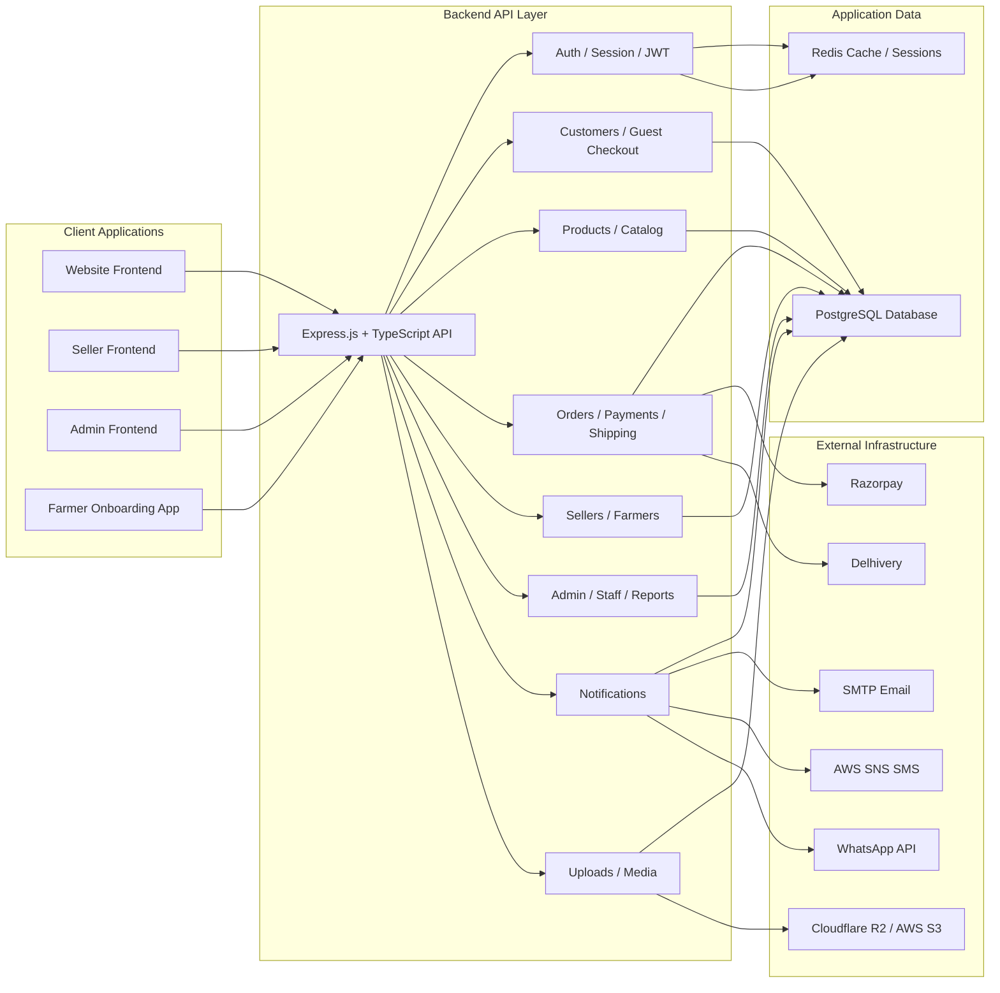
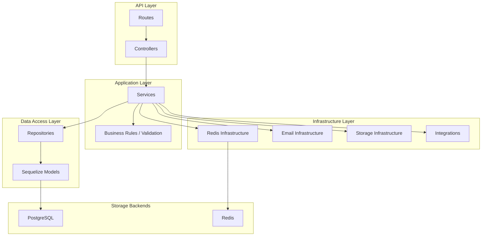
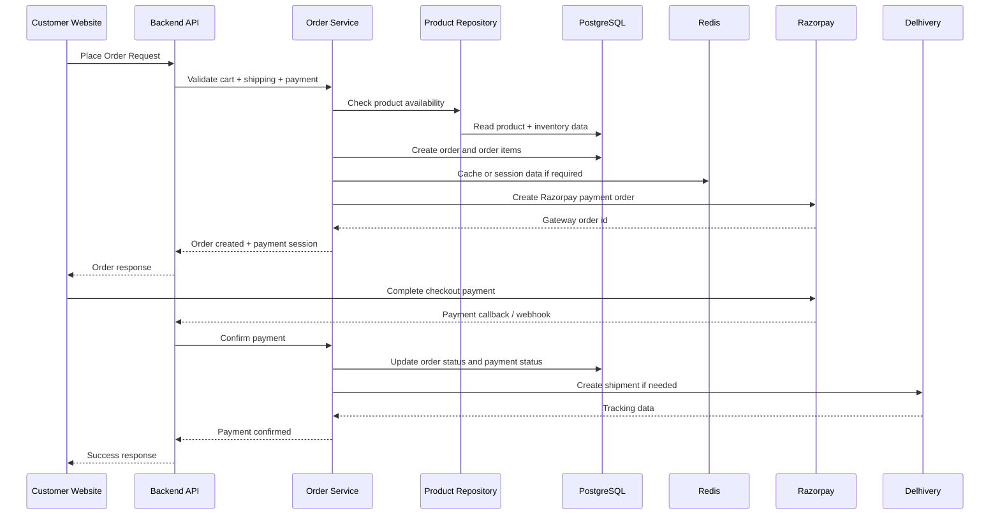
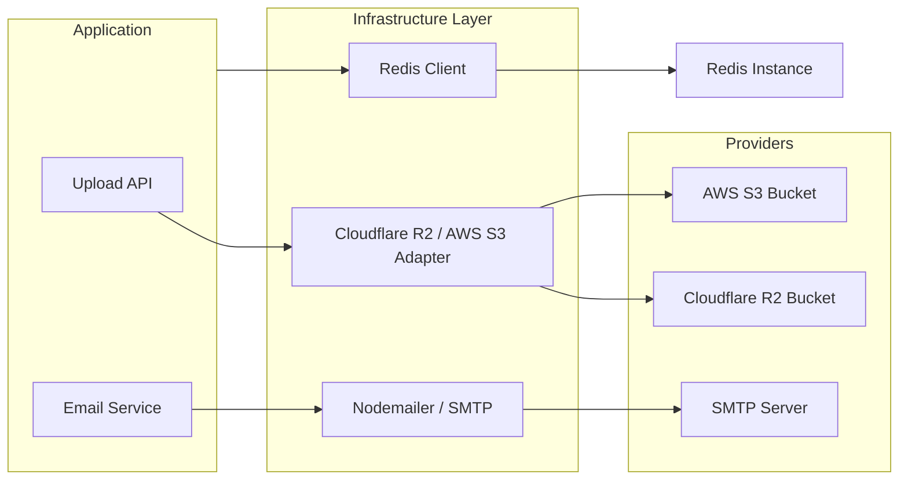
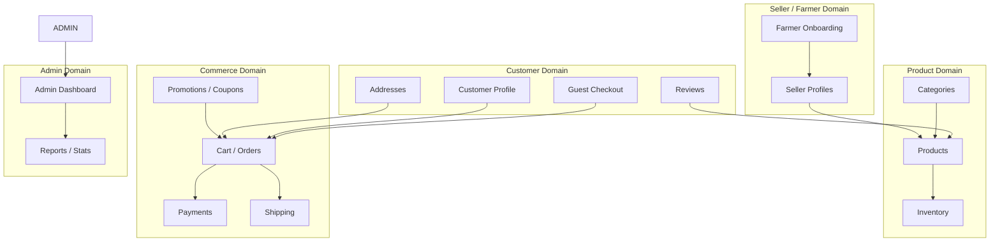

# Sappey System Design Diagram

## Overview Diagram

## Backend Layer Diagram

## Order Flow Diagram

## Storage and Email Architecture

## Domain Modules Map

## Product Fetch Behavior

- Product listing endpoints such as GET /products and GET /products/search use Redis caching in the repository layer to reduce repeated catalog queries.
- Product detail fetch endpoints such as GET /products/:id and GET /products/:slug are resolved directly from PostgreSQL through the repository, then image URLs are signed from Cloudflare R2 / S3 before returning the final payload.
- In other words, list-product reads are Redis-assisted, while single-product detail reads are direct database reads without Redis in the current implementation.

## Notes

- Frontend apps are separated by portal role: website, seller, admin, and farmer onboarding.
- Backend follows a layered architecture: routes, controllers, services, repositories, database models.
- Infrastructure code is centralized for Redis, email, storage, and external integrations.
- Payment and shipping integrations are isolated from business logic for easier scaling and maintenance.
